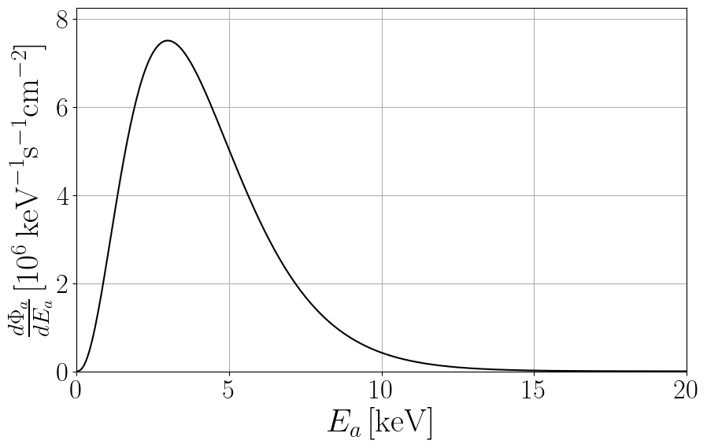
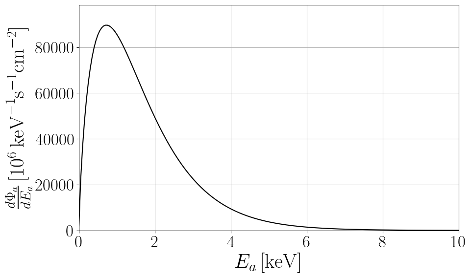
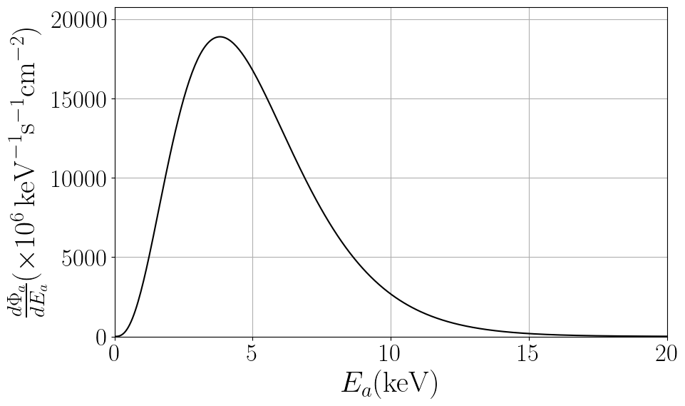
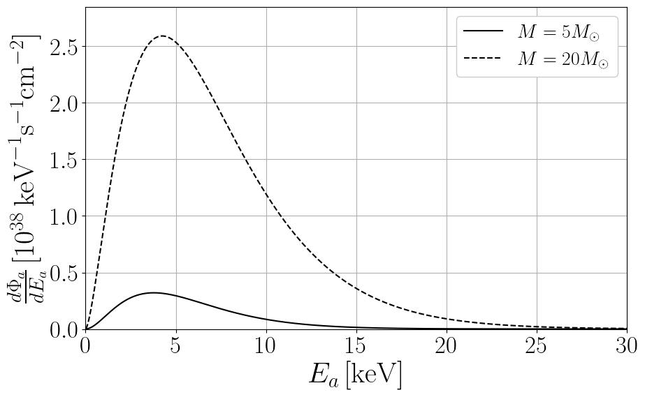
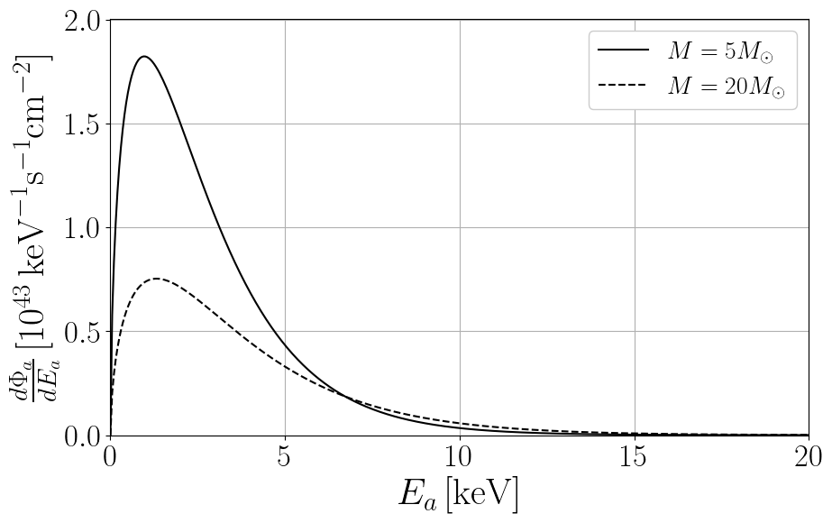
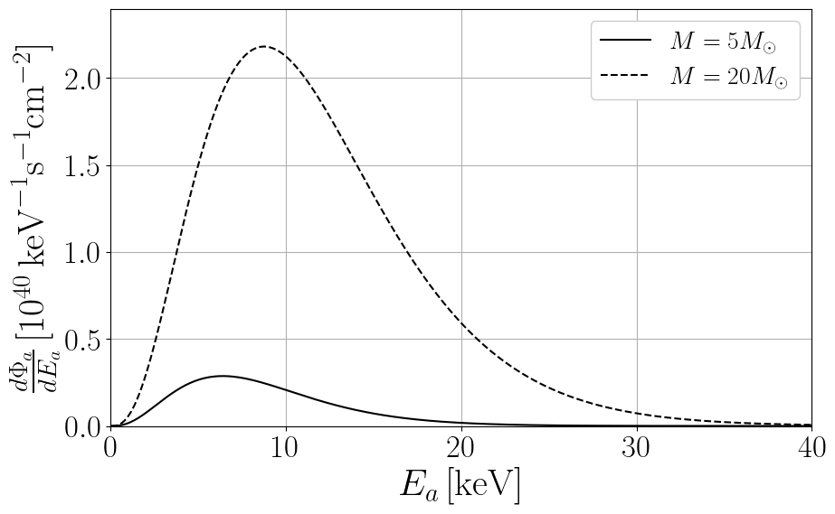

This webpage hosts data files and python notebooks for axion astrophysical fluxes. 

Please, email me [giovanni.grilli@lngs.infn.it] for questions, comments or complaints.

# Solar Axions

<!-- Solar model: AGSS09 [[Serenelli et al. 2009](https://iopscience.iop.org/article/10.1088/0004-637X/705/2/L123), [Serenelli 2010](https://link.springer.com/article/10.1007/s10509-009-0174-8)]-->


An accurate fit of solar axion fluxes at Earth obtained after integrating over the AGSS09 solar model [[Serenelli et al. 2009](https://iopscience.iop.org/article/10.1088/0004-637X/705/2/L123), [Serenelli 2010](https://link.springer.com/article/10.1007/s10509-009-0174-8)] is:

<!--$$
\frac{d\Phi_a}{dE_a}= C_0 \left(\frac{g_{ax}}{g_{\mathrm{ref}}}\right)^2 \left(\frac{E}{E_0}\right)^\beta e^{-(1+\beta)\frac{E}{E_0}}
$$ -->

^2 \left(\frac{E}{E_0}\right)^\beta e^{-(1+\beta)\frac{E}{E_0}})

```math
$$\frac{d\Phi_a}{dE_a}= C_0 \left(\frac{g_{ax}}{g_{\mathrm{ref}}}\right)^2 \left(\frac{E}{E_0}\right)^\beta e^{-(1+\beta)\frac{E}{E_0}}$$
```

<div class="math">
    \[
    \frac{d\Phi_a}{dE_a}= C_0 \left(\frac{g_{ax}}{g_{\mathrm{ref}}}\right)^2 \left(\frac{E}{E_0}\right)^\beta e^{-(1+\beta)\frac{E}{E_0}}
    \]
</div>

<span class="math">\( g_{\text{ref}} \)</span>

$g_{\text{ref}}$

where the axion parameters are shown in the following Table.

<!--
|                              | $`g_{\text{ref}}`$              | $$ C_0  (\text{keV}^{-1}~\text{s}^{-1}~\text{cm}^{-2})$$    | $$ E_0 (\text{keV})$$    | $$ \beta $$             |
|------------------------------|----------------------------------|-------------------------------------------------------------|--------------------------|-------------------------|
| Primakoff, $x = \gamma $     | $$ 10^{-12}~\text{GeV}^{-1} $$  | $$ (2.19 \pm 0.08) \times 10^8 $$                           | $$ 4.17 \pm 0.02 $$      | $$ 2.531 \pm 0.008 $$   |
| Bremsstrahlung, $ x = e $    | $$ 10^{-12} $$                  | $$ (3.847 \pm 0.007) \times 10^{11} $$                      | $$ 1.63 \pm 0.01 $$      | $$ 0.8063 \pm 0.0003 $$ |
| Compton, $ x = e $           | $$ 10^{-12} $$                  | $$ (8.8 \pm 0.1) \times 10^{11} $$                          | $$ 5.10 \pm 0.03 $$      | $$ 2.979 \pm 0.001 $$   |

**Table:** Summary of the fitting parameters to be used in the equation above to reproduce the axion emission from the Sun via Primakoff (coupling to photons $ g_{a\gamma} $), Bremsstrahlung, and Compton (coupling to electrons $g_{ae}$). The uncertainty on the fitting parameters includes the most recent solar models (Magg:2022rxb).
-->


### [View Notebook (.ipynb)](https://github.com/ggrillidc/AxionAstrophysicalFluxes/blob/main/notebooks/SolarAxions.ipynb)

---



**Primakoff**


Plot ([pdf](https://github.com/ggrillidc/AxionAstrophysicalFluxes/raw/main/plots/Primakoff_SolarAxion_flux_plot.pdf), [png](https://github.com/ggrillidc/AxionAstrophysicalFluxes/raw/main/plots/plots_png/Primakoff_SolarAxion_flux_plot.png))
### &nbsp;
### &nbsp;
### &nbsp;
### &nbsp;


---



**Bremsstrahlung**


Plot ([pdf](https://github.com/ggrillidc/AxionAstrophysicalFluxes/raw/main/plots/Bremsstrahlung_SolarAxion_flux_plot.pdf), [png](https://github.com/ggrillidc/AxionAstrophysicalFluxes/raw/main/plots/plots_png/Bremsstrahlung_SolarAxion_flux_plot.png))


### &nbsp;
### &nbsp;
### &nbsp;
### &nbsp;


---



**Compton**


Plot ([pdf](https://github.com/ggrillidc/AxionAstrophysicalFluxes/raw/main/plots/Compton_SolarAxion_flux_plot.pdf), [png](https://github.com/ggrillidc/AxionAstrophysicalFluxes/raw/main/plots/plots_png/Compton_SolarAxion_flux_plot.png))


### &nbsp;
### &nbsp;
### &nbsp;
### &nbsp;


---

# Main Sequence stars axions

### [View Notebook (.ipynb)](https://github.com/ggrillidc/AxionAstrophysicalFluxes/blob/main/notebooks/MainSequenceAxions.ipynb)

---



**Primakoff**


Plot ([pdf](https://github.com/ggrillidc/AxionAstrophysicalFluxes/raw/main/plots/Primakoff_MSAxion_flux_plot.pdf), [png](https://github.com/ggrillidc/AxionAstrophysicalFluxes/raw/main/plots/plots_png/Primakoff_MSAxion_flux_plot.png))
### &nbsp;
### &nbsp;
### &nbsp;
### &nbsp;


---



**Bremsstrahlung**


Plot ([pdf](https://github.com/ggrillidc/AxionAstrophysicalFluxes/raw/main/plots/Bremsstrahlung_MSAxion_flux_plot.pdf), [png](https://github.com/ggrillidc/AxionAstrophysicalFluxes/raw/main/plots/plots_png/Bremsstrahlung_MSAxion_flux_plot.png))


### &nbsp;
### &nbsp;
### &nbsp;
### &nbsp;


---



**Compton**


Plot ([pdf](https://github.com/ggrillidc/AxionAstrophysicalFluxes/raw/main/plots/Compton_MSAxion_flux_plot.pdf), [png](https://github.com/ggrillidc/AxionAstrophysicalFluxes/raw/main/plots/plots_png/Compton_MSAxion_flux_plot.png))


### &nbsp;
### &nbsp;
### &nbsp;
### &nbsp;


---

# Red Giants axions


---

# Horizontal Branch stars axions


---

# Asymptotic Red Giants axions


---

# White Dwarfs axions


---

# Red Supergiants axions

---

# Core-collapse Supernovae axions


---

# Neutron stars axions


---

# Binary neutron star mergers axions