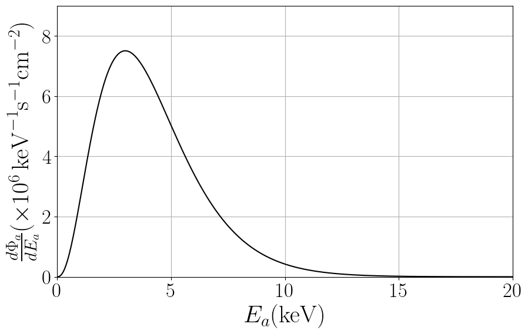
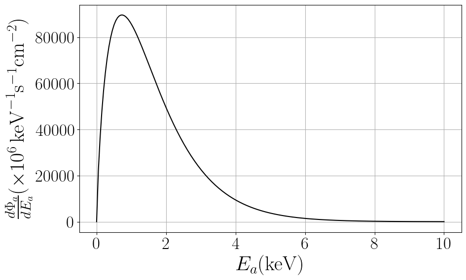
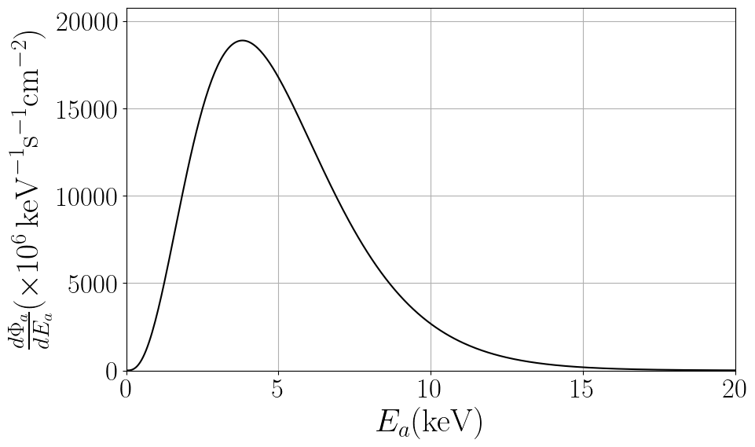

This webpage hosts data files and python notebooks for axion astrophysical fluxes. 

Please, email me [ggrillidc@gmail.com] for questions, comments or complaints.

# Solar Axions

### [View Notebok (.ipynb)](https://github.com/ggrillidc/AxionAstrophysicalFluxes/blob/main/notebooks/SolarAxions.ipynb)

---

**Primakoff**

Plot ([pdf](https://github.com/ggrillidc/AxionAstrophysicalFluxes/raw/main/plots/Primakoff_axion_flux_plot.pdf), [png](https://github.com/ggrillidc/AxionAstrophysicalFluxes/raw/main/plots/plots_png/Primakoff_axion_flux_plot.png))
### &nbsp;
### &nbsp;
### &nbsp;
### &nbsp;

---

**Bremsstrahlung**

Plot ([pdf](https://github.com/ggrillidc/AxionAstrophysicalFluxes/raw/main/plots/Bremsstrahlung_axion_flux_plot.pdf), [png](https://github.com/ggrillidc/AxionAstrophysicalFluxes/raw/main/plots/plots_png/Bremsstrahlung_axion_flux_plot.png))

### &nbsp;
### &nbsp;
### &nbsp;
### &nbsp;

---

**Compton**

Plot ([pdf](https://github.com/ggrillidc/AxionAstrophysicalFluxes/raw/main/plots/Compton_axion_flux_plot.pdf), [png](https://github.com/ggrillidc/AxionAstrophysicalFluxes/raw/main/plots/plots_png/Compton_axion_flux_plot.png))

### &nbsp;
### &nbsp;
### &nbsp;
### &nbsp;

---

# Main Sequence stars axions

---

# Red Giants axions

---

# Horizontal Branch stars axions

---

# Asymptotic Red Giants axions

---

# White Dwarfs axions

---

# Red Supergiants axions

---

# Core-collapse Supernovae axions

---

# Neutron stars axions

---

# Binary neutron star mergers axions