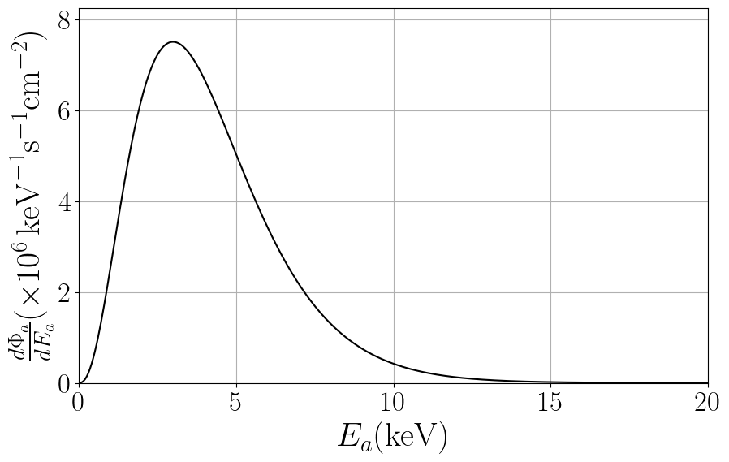
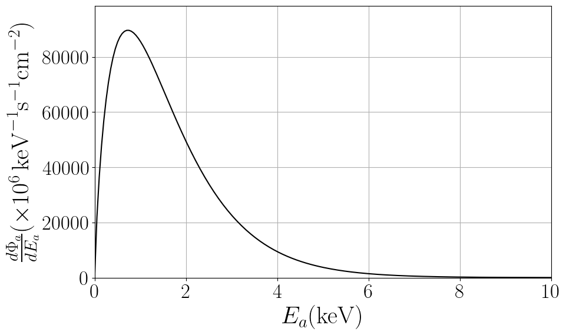

This webpage hosts data files and python notebooks for axion astrophysical fluxes. 

Please, email me [ggrillidc@gmail.com] for questions, comments or complaints.

## Solar Axions

# Solar axion emission

An accurate fit of solar axion fluxes at Earth obtained after integrating over the AGSS09 solar model (Refs. [], []) is:
\begin{equation}
\frac{d\Phi_a}{dE_a}= C_0 \left(\frac{g_{ax}}{g_{\mathrm{ref}}}\right)^2 \left(\frac{E}{E_0}\right)^\beta e^{-(1+\beta)\frac{E}{E_0}}
\end{equation}
where the axion parameters are shown in following Table.

|                              |  $$g_{\text{ref}}$$              | $$ C_0  (\text{keV}^{-1}~\text{s}^{-1}~\text{cm}^{-2})$$    | $$ E_0 (\text{keV})$$    | $$ \beta $$             |
|------------------------------|----------------------------------|-------------------------------------------------------------|--------------------------|-------------------------|
| Primakoff, $x = \gamma $  | $$ 10^{-12}~\text{GeV}^{-1} $$   | $$ (2.19 \pm 0.08) \times 10^8 $$                           | $$ 4.17 \pm 0.02 $$      | $$ 2.531 \pm 0.008 $$   |
| Bremsstrahlung, $ x = e $  | $$ 10^{-12} $$                   | $$ (3.847 \pm 0.007) \times 10^{11} $$                      | $$ 1.63 \pm 0.01 $$      | $$ 0.8063 \pm 0.0003 $$ |
| Compton, $ x = e $         | $$ 10^{-12} $$                   | $$ (8.8 \pm 0.1) \times 10^{11} $$                          | $$ 5.10 \pm 0.03 $$      | $$ 2.979 \pm 0.001 $$   |

**Table:** Summary of the fitting parameters to be used in Eq.~(fitprim) to reproduce the axion emission from the Sun via Primakoff (coupling to photons $ g_{a\gamma} $), Bremsstrahlung and Compton (coupling to electrons $g_{ae}$). The uncertainty on the fitting parameters includes the most recent solar models (Magg:2022rxb).

### [View Notebok (.ipynb)](https://github.com/ggrillidc/AxionAstrophysicalFluxes/blob/main/notebooks/SolarAxions.ipynb)

---

**Primakoff**

Plot ([pdf](https://github.com/ggrillidc/AxionAstrophysicalFluxes/raw/main/plots/Primakoff_axion_flux_plot.pdf), [png](https://github.com/ggrillidc/AxionAstrophysicalFluxes/raw/main/plots/plots_png/Primakoff_axion_flux_plot.png))

### &nbsp;
### &nbsp;
### &nbsp;
### &nbsp;

---

**Bremsstrahlung**

Plot ([pdf](https://github.com/ggrillidc/AxionAstrophysicalFluxes/raw/main/plots/Bremsstrahlung_axion_flux_plot.pdf), [png](https://github.com/ggrillidc/AxionAstrophysicalFluxes/raw/main/plots/plots_png/Bremsstrahlung_axion_flux_plot.png))

### &nbsp;
### &nbsp;
### &nbsp;
### &nbsp;

---

**Compton**

Plot ([pdf](https://github.com/ggrillidc/AxionAstrophysicalFluxes/raw/main/plots/Compton_axion_flux_plot.pdf), [png](https://github.com/ggrillidc/AxionAstrophysicalFluxes/raw/main/plots/plots_png/Compton_axion_flux_plot.png))

### &nbsp;
### &nbsp;
### &nbsp;
### &nbsp;

---

### ALP source spectrum from Betelgeuse
