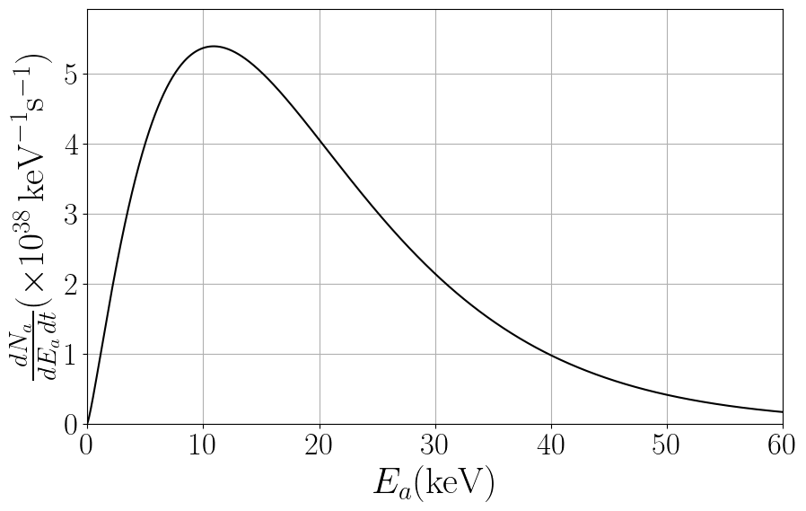
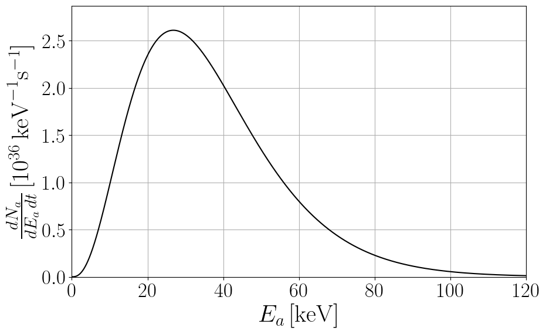
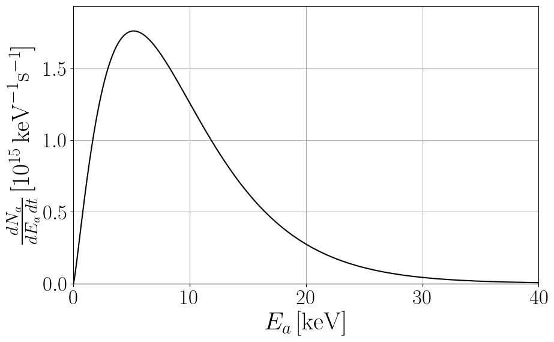
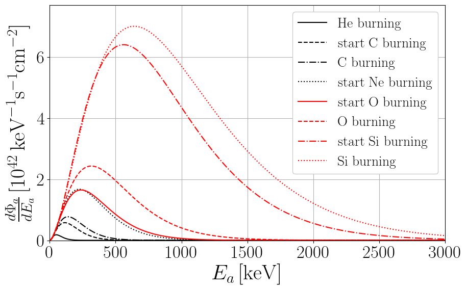
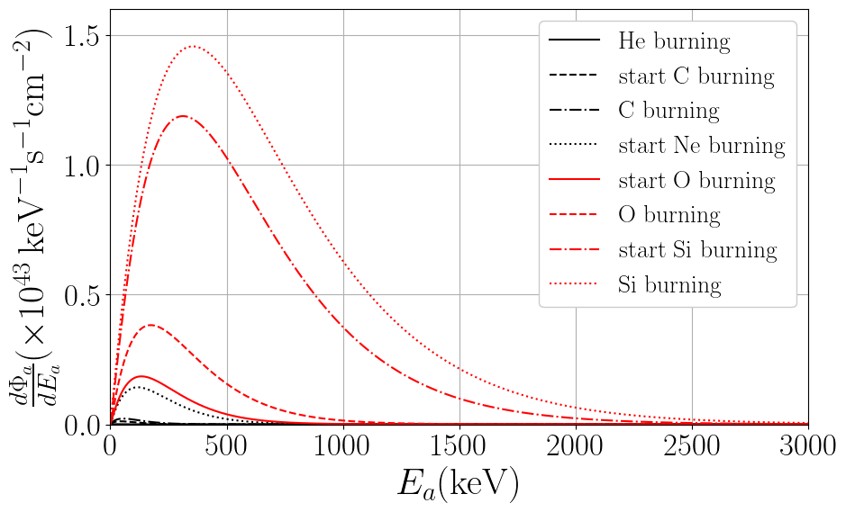
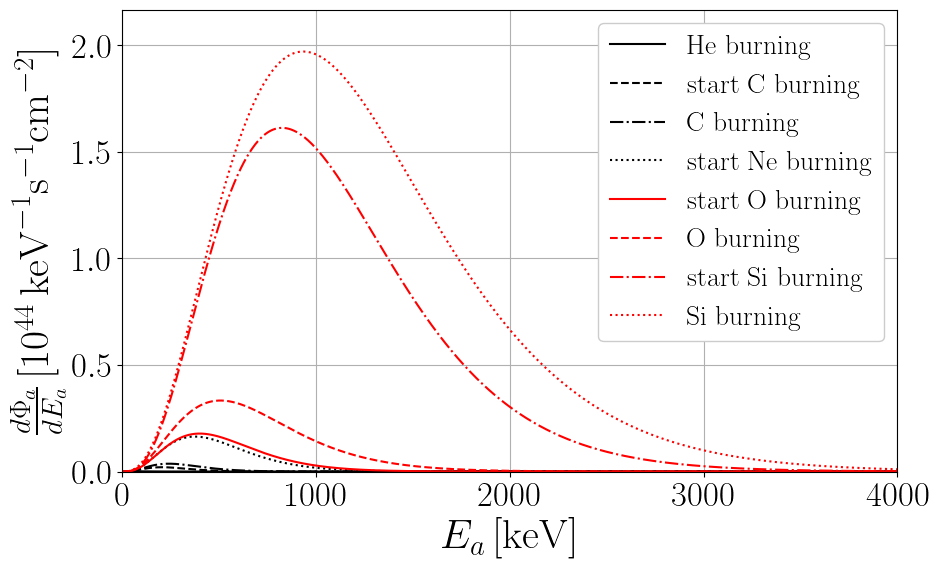
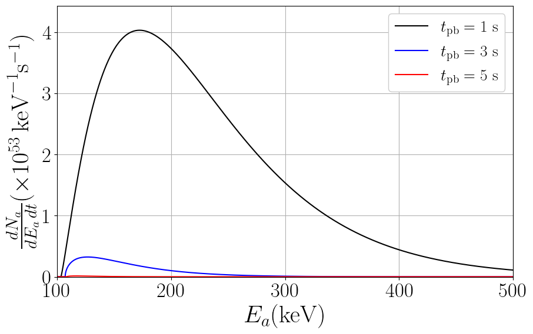

This webpage hosts data files and python notebooks for axion astrophysical fluxes. 

Please, email me [giovanni.grilli@lngs.infn.it] for questions, comments or complaints.

# Solar Axions

<!-- Solar model: AGSS09 [[Serenelli et al. 2009](https://iopscience.iop.org/article/10.1088/0004-637X/705/2/L123), [Serenelli 2010](https://link.springer.com/article/10.1007/s10509-009-0174-8)]-->

An accurate fit of solar axion fluxes at Earth obtained after integrating over the AGSS09 solar model [[Serenelli et al. 2009](https://iopscience.iop.org/article/10.1088/0004-637X/705/2/L123), [Serenelli 2010](https://link.springer.com/article/10.1007/s10509-009-0174-8)] is given by:

$$
\frac{d\Phi_a}{dE_a}= C_0 \left(\frac{g_{ax}}{g_{\mathrm{ref}}}\right)^2 \left(\frac{E}{E_0}\right)^\beta e^{-(1+\beta)\frac{E}{E_0}},
$$

where the axion parameters are shown in the following Table:

|                              | $$g_{\text{ref}}$$              | $$ C_0  (\text{keV}^{-1}~\text{s}^{-1}~\text{cm}^{-2})$$    | $$ E_0 (\text{keV})$$    | $$ \beta $$             |
|------------------------------|----------------------------------|-------------------------------------------------------------|--------------------------|-------------------------|
| Primakoff, $$x = \gamma $$     | $$ 10^{-12}~\text{GeV}^{-1} $$  | $$ (2.19 \pm 0.08)\,10^8 $$                           | $$ 4.17 \pm 0.02 $$      | $$ 2.531 \pm 0.008 $$   |
| Bremsstrahlung, $$ x = e $$    | $$ 10^{-12} $$                  | $$ (3.847 \pm 0.007)\,10^{11} $$                      | $$ 1.63 \pm 0.01 $$      | $$ 0.8063 \pm 0.0003 $$ |
| Compton, $$ x = e $$           | $$ 10^{-12} $$                  | $$ (8.8 \pm 0.1) \, 10^{11} $$                          | $$ 5.10 \pm 0.03 $$      | $$ 2.979 \pm 0.001 $$   |

**Table:** Summary of the fitting parameters to reproduce the axion emission from the Sun via Primakoff (coupling to photons $$g_{a\gamma}$$), Bremsstrahlung, and Compton (coupling to electrons $$g_{ae}$$), see [[Hoof et al.](https://iopscience.iop.org/article/10.1088/1475-7516/2024/11/009), [Wu and Xu](https://iopscience.iop.org/article/10.1088/1475-7516/2021/09/006)] and the [GitHub code](https://github.com/pcarenza95/SolarAxionCode). The uncertainty on the fitting parameters includes the most recent solar models [[Magg et al. 2022](https://www.aanda.org/articles/aa/full_html/2022/05/aa42971-21/aa42971-21.html)].

### [View Notebook (.ipynb)](https://github.com/ggrillidc/AxionAstrophysicalFluxes/blob/main/notebooks/SolarAxions.ipynb)

---

## Primakoff

$$g_{a\gamma}=10^{-12}\,\text{GeV}^{-1}$$

Plot ([pdf](https://github.com/ggrillidc/AxionAstrophysicalFluxes/raw/main/plots/Primakoff_SolarAxion_flux_plot.pdf), [png](https://github.com/ggrillidc/AxionAstrophysicalFluxes/raw/main/plots/plots_png/Primakoff_SolarAxion_flux_plot.png))
### &nbsp;
### &nbsp;
### &nbsp;
### &nbsp;

---

## Bremsstrahlung

$$g_{ae}=10^{-12}$$

Plot ([pdf](https://github.com/ggrillidc/AxionAstrophysicalFluxes/raw/main/plots/Bremsstrahlung_SolarAxion_flux_plot.pdf), [png](https://github.com/ggrillidc/AxionAstrophysicalFluxes/raw/main/plots/plots_png/Bremsstrahlung_SolarAxion_flux_plot.png))

### &nbsp;
### &nbsp;
### &nbsp;
### &nbsp;

---

## Compton

$$g_{ae}=10^{-12}$$

Plot ([pdf](https://github.com/ggrillidc/AxionAstrophysicalFluxes/raw/main/plots/Compton_SolarAxion_flux_plot.pdf), [png](https://github.com/ggrillidc/AxionAstrophysicalFluxes/raw/main/plots/plots_png/Compton_SolarAxion_flux_plot.png))

### &nbsp;
### &nbsp;
### &nbsp;
### &nbsp;

---

# Main Sequence stars axions

The quasi-thermal Main Sequence stars axion spectrum at the source can be parametrized by 

$$
\frac{d\Phi_a}{dE_a}= C_0 \left(\frac{g_{ax}}{g_{\mathrm{ref}}}\right)^2 \left(\frac{E}{E_0}\right)^\beta e^{-(1+\beta)\frac{E}{E_0}}
$$

where the axion parameters are now a function of the stellar mass and are given in the following Table:

|  | $$g_{a x}$$ | $$C_{0} (10^{40}\,\text{keV}^{-1}\,\text{s}^{-1}\,\text{cm}^{-2})$$ | $$E_{0} (\text{keV})$$ | $$\beta$$ |
|---|---|---|---|---|
| Primakoff $$x=\gamma$$ | $$10^{-12}\,\text{GeV}^{-1}$$ | $$\begin{cases} -0.140+0.053\,M^{-0.347}e^{M^{0.379}} & \text{for } M<10\,M_{\odot} \\ -0.014+0.011\,M^{1.081} & \text{for } M\geq 10 \, M_{\odot} \end{cases}$$ | $$3.70+1.13\,M^{0.355}$$ | $$1.23+3.63\,e^{-M^{0.29}}$$ |
| Bremsstrahlung $$x=e$$ | $$10^{-12}$$ | $$55.21+1.62\times10^{4}M^{-0.65}$$ | $$0.06+1.80\,M^{0.23}$$ | $$\begin{cases} 0.57 + 0.18 e^{-M^{1.09}} & \text{for } M\le 10 \, M_{\odot} \\ 0.48+0.05 \,M^{0.19} & \text{for } M\geq 10 \, M_{\odot} \end{cases}$$ |
| Compton $$x=e$$ | $$10^{-12}$$ | $$0.14+1.01\,M^{1.49}$$ | $$0.025+6.014\,M^{0.225}$$ | $$2.99-0.56\,e^{-M^{0.09}}$$ |

**Table:** Summary of the fitting parameters to be used in the equation above, where $$M$$ is in units of solar masses $${\rm M}_{\odot}$$. These fits are valid in the range $$1-100~{\rm M}_{\odot}$$ and can be obtained by this [GitHub code](https://github.com/pcarenza95/MainSequence-Axion).

### [View Notebook (.ipynb)](https://github.com/ggrillidc/AxionAstrophysicalFluxes/blob/main/notebooks/MainSequenceAxions.ipynb)

---

## Primakoff

$$g_{a\gamma}=10^{-12}\,\text{GeV}^{-1}$$

Plot ([pdf](https://github.com/ggrillidc/AxionAstrophysicalFluxes/raw/main/plots/Primakoff_MSAxion_flux_plot.pdf), [png](https://github.com/ggrillidc/AxionAstrophysicalFluxes/raw/main/plots/plots_png/Primakoff_MSAxion_flux_plot.png))
### &nbsp;
### &nbsp;
### &nbsp;
### &nbsp;

---

## Bremsstrahlung

$$g_{ae}=10^{-12}$$

Plot ([pdf](https://github.com/ggrillidc/AxionAstrophysicalFluxes/raw/main/plots/Bremsstrahlung_MSAxion_flux_plot.pdf), [png](https://github.com/ggrillidc/AxionAstrophysicalFluxes/raw/main/plots/plots_png/Bremsstrahlung_MSAxion_flux_plot.png))

### &nbsp;
### &nbsp;
### &nbsp;
### &nbsp;

---

## Compton

$$g_{ae}=10^{-12}$$

Plot ([pdf](https://github.com/ggrillidc/AxionAstrophysicalFluxes/raw/main/plots/Compton_MSAxion_flux_plot.pdf), [png](https://github.com/ggrillidc/AxionAstrophysicalFluxes/raw/main/plots/plots_png/Compton_MSAxion_flux_plot.png))

### &nbsp;
### &nbsp;
### &nbsp;
### &nbsp;

---

# Red Giants axions

Red Giants axions are mainly produced via their coupling to electrons, with the electron-ion bremsstrahlung process $$e + Ze \to e + Ze + a$$ as the main production channel. This emission rate is studied in detail in Refs. [[Carenza and Lucente 2022](https://www.aanda.org/articles/aa/full_html/2022/05/aa42971-21/aa42971-21.html), [Fiorillo et al.](https://arxiv.org/abs/2503.15630)]. The Red Giant axion emission spectrum is given by

$$
\frac{dN_a}{dE_a dt}= 10^{39}\,\mathrm{keV}^{-1}\,\mathrm{s}^{-1}\left(\frac{g_{ae}}{10^{-13}}\right)^2\,C_0 \left(\frac{E}{E_0}\right)^\beta e^{-(1+\beta)\frac{E}{E_0}},
$$

with 

$$
C_0=3.92\qquad E_0=19.63\,\,\mathrm{keV}\qquad \beta=1.25\,.
$$

### [View Notebook (.ipynb)](https://github.com/ggrillidc/AxionAstrophysicalFluxes/blob/main/notebooks/RedGiantAxions.ipynb)

---

## Electron-ion bremsstrahlung

$$g_{ae}=10^{-13}$$

Plot ([pdf](https://github.com/ggrillidc/AxionAstrophysicalFluxes/raw/main/plots/RGAxion_flux_plot.pdf), [png](https://github.com/ggrillidc/AxionAstrophysicalFluxes/raw/main/plots/plots_png/RGAxion_flux_plot.png))

### &nbsp;
### &nbsp;
### &nbsp;
### &nbsp;

---

# Horizontal Branch stars axions

The main production channel for axions interacting with photons in horizontal branch (HB) stars is the Primakoff effect. In this case, the production spectrum is fitted as

$$
\frac{dN_a}{dE_a dt}= 10^{36}\,\mathrm{keV}^{-1}\,\mathrm{s}^{-1}\left(\frac{g_{a\gamma}}{10^{-12}\mathrm{GeV}^{-1}}\right)^2\,C_0 \left(\frac{E}{E_0}\right)^\beta e^{-(1+\beta)\frac{E}{E_0}},
$$

with 

$$
C_0=94.76\qquad E_0=36.59\,\,\mathrm{keV}\qquad \beta=2.74\,.
$$

### [View Notebook (.ipynb)](https://github.com/ggrillidc/AxionAstrophysicalFluxes/blob/main/notebooks/HorizontalBranchAxions.ipynb)

---

## Primakoff

$$g_{a\gamma}=10^{-12}$$

Plot ([pdf](https://github.com/ggrillidc/AxionAstrophysicalFluxes/raw/main/plots/HBAxion_flux_plot.pdf), [png](https://github.com/ggrillidc/AxionAstrophysicalFluxes/raw/main/plots/plots_png/HBAxion_flux_plot.png))

### &nbsp;
### &nbsp;
### &nbsp;
### &nbsp;

---

# Asymptotic Red Giants axions

---

# White Dwarfs axions

White Dwarfs axions are mainly produced via their coupling to electrons, with the electron-ion bremsstrahlung process $$e + Ze \to e + Ze + a$$ as the main production channel involving mainly carbon and oxygen. The White Dwarf axion emission spectrum is given by

$$
\frac{dN_a}{dE_a dt}= 10^{16}\,\mathrm{keV}^{-1}\,\mathrm{s}^{-1}\left(\frac{g_{ae}}{10^{-13}}\right)^2\,C_0 \left(\frac{E}{E_0}\right)^\beta e^{-(1+\beta)\frac{E}{E_0}},
$$

with 

$$
C_0=1.25\qquad E_0=9.38\,\,\mathrm{keV}\qquad \beta=1.23\,.
$$

### [View Notebook (.ipynb)](https://github.com/ggrillidc/AxionAstrophysicalFluxes/blob/main/notebooks/WhiteDwarfAxions.ipynb)

---

## Electron-ion bremsstrahlung

$$g_{ae}=10^{-13}$$

Plot ([pdf](https://github.com/ggrillidc/AxionAstrophysicalFluxes/raw/main/plots/WDAxion_flux_plot.pdf), [png](https://github.com/ggrillidc/AxionAstrophysicalFluxes/raw/main/plots/plots_png/WDAxion_flux_plot.png))

### &nbsp;
### &nbsp;
### &nbsp;
### &nbsp;

---

# Red Supergiants axions

ALP production in massive stars at supergiant stages is dominated by their couplings to photons and electrons. The dominant ALP production process induced by the ALP-photon interaction is the Primakoff effect, $$\gamma + Ze \rightarrow a + Ze$$, corresponding to the conversion of a thermal photon into an ALP in the electrostatic field of charged particles in the stellar plasma [[Carlson](https://doi.org/10.1016/0370-2693(94)01529-L)]. On the other hand, axions interacting with electrons are mainly produced via Compton scattering, $$\gamma + e \rightarrow e + a$$ [[Raffelt](https://wwwth.mpp.mpg.de/members/raffelt/mypapers/Stars.pdf)], and the electron-ion Bremsstrahlung, $$e + Ze \rightarrow e + Ze + a$$[[Carenza and Lucente](https://journals.aps.org/prd/abstract/10.1103/PhysRevD.103.123024)]. The total amount of ALPs produced by the star is obtained by integrating the production rates over the entire volume of the star. The Red-Giant Brach (RGB) ALP production spectrum integrated over the star volume can be fitted as

$$
\frac{d N_a}{dE dt}=\frac{10^{42}}{\mathrm{keV}\,\mathrm{s}}\biggl[{\mathcal C}_B\,g_{13}^2\,\left(\frac{E}{E_{0,B}}\right)^{\beta_B}\,e^{-(\beta_B+1)E/E_{0,B}}\\ 
+ {\mathcal C}_C\,g_{13}^2\,\left(\frac{E}{E_{0_C}}\right)^{\beta_C}\,e^{-(\beta_C+1)E/E_{0,C}} \\ 
+ {\mathcal C}_P\,g_{11}^2\,\left(\frac{E}{E_{0,P}}\right)^{\beta_P}\,e^{-(\beta_P+1)E/E_{0,P}}\biggr]\,,
$$

where $$g_{11} \equiv g_{a\gamma}/10^{-11}\,\mathrm{GeV}^{-1}$$, $$g_{13}\equiv g_{ae}/10^{-13}$$, $${\mathcal C}_{B/C/P}$$ are normalization constants, $$E_{0,{B/C/P}}$$ is the average energy and $$\beta_{B/C/P}$$ is the spectral index for Bremsstrahlung, Compton and Primakoff processes, respectively. 

<table>
<thead>
<tr>
  <th rowspan="2">Model</th>
  <th rowspan="2">Phase</th>
  <th colspan="3">Primakoff</th>
  <th colspan="3">Bremsstrahlung</th>
  <th colspan="3">Compton</th>
</tr>
<tr>
  <th>$$\mathcal{C}_P$$</th>
  <th>$$E_{0,P}$$ [keV]</th>
  <th>$$\beta_P$$</th>
  <th>$$\mathcal{C}_B$$</th>
  <th>$$E_{0,B}$$ [keV]</th>
  <th>$$\beta_B$$</th>
  <th>$$\mathcal{C}_C$$</th>
  <th>$$E_{0,C}$$ [keV]</th>
  <th>$$\beta_C$$</th>
</tr>
</thead>
<tbody>
<tr>
  <td>1</td><td>He burning</td>
  <td>$$3.36$$</td><td>$$74.7$$</td><td>$$2.10$$</td>
  <td>$$2.18\cdot10^{-2}$$</td><td>$$36.1$$</td><td>$$0.732$$</td>
  <td>$$5.24$$</td><td>$$115$$</td><td>$$3.12$$</td>
</tr>
<tr>
  <td>2</td><td>start C burning</td>
  <td>$$9.70$$</td><td>$$173$$</td><td>$$2.01$$</td>
  <td>$$0.530$$</td><td>$$95.3$$</td><td>$$0.857$$</td>
  <td>$$116$$</td><td>$$267$$</td><td>$$3.18$$</td>
</tr>
<tr>
  <td>3</td><td>C burning</td>
  <td>$$13.1$$</td><td>$$208$$</td><td>$$2.02$$</td>
  <td>$$1.06$$</td><td>$$118$$</td><td>$$0.901$$</td>
  <td>$$211$$</td><td>$$315$$</td><td>$$3.18$$</td>
</tr>
<tr>
  <td>4</td><td>start Ne burning</td>
  <td>$$26.9$$</td><td>$$339$$</td><td>$$1.97$$</td>
  <td>$$8.53$$</td><td>$$226$$</td><td>$$1.08$$</td>
  <td>$$991$$</td><td>$$489$$</td><td>$$3.23$$</td>
</tr>
<tr>
  <td>5</td><td>start O burning</td>
  <td>$$23.3$$</td><td>$$367$$</td><td>$$1.85$$</td>
  <td>$$11.3$$</td><td>$$255$$</td><td>$$1.10$$</td>
  <td>$$991$$</td><td>$$525$$</td><td>$$3.15$$</td>
</tr>
<tr>
  <td>6</td><td>O burning</td>
  <td>$$31.5$$</td><td>$$495$$</td><td>$$1.77$$</td>
  <td>$$23.1$$</td><td>$$333$$</td><td>$$1.09$$</td>
  <td>$$1430$$</td><td>$$680$$</td><td>$$2.90$$</td>
</tr>
<tr>
  <td>7</td><td>start Si burning</td>
  <td>$$94.5$$</td><td>$$858$$</td><td>$$1.89$$</td>
  <td>$$73.5$$</td><td>$$593$$</td><td>$$1.11$$</td>
  <td>$$8430$$</td><td>$$1090$$</td><td>$$3.09$$</td>
</tr>
<tr>
  <td>8</td><td>Si burning</td>
  <td>$$92.8$$</td><td>$$1000$$</td><td>$$1.79$$</td>
  <td>$$86.0$$</td><td>$$685$$</td><td>$$1.07$$</td>
  <td>$$8030$$</td><td>$$1260$$</td><td>$$2.85$$</td>
</tr>
</tbody>
</table>

**Table:** Summary of the fitting parameters to be used in the equation above.

### [View Notebook (.ipynb)](https://github.com/ggrillidc/AxionAstrophysicalFluxes/blob/main/notebooks/RedSuperGiantsAxions.ipynb)

---

## Primakoff

$$g_{a\gamma}=10^{-11}\,\text{GeV}^{-1}$$

Plot ([pdf](https://github.com/ggrillidc/AxionAstrophysicalFluxes/raw/main/plots/Primakoff_RSGAxion_flux_plot.pdf), [png](https://github.com/ggrillidc/AxionAstrophysicalFluxes/raw/main/plots/plots_png/Primakoff_RSGAxion_flux_plot.png))
### &nbsp;
### &nbsp;
### &nbsp;
### &nbsp;

---

## Bremsstrahlung

$$g_{ae}=10^{-13}$$

Plot ([pdf](https://github.com/ggrillidc/AxionAstrophysicalFluxes/raw/main/plots/Bremsstrahlung_RSGAxion_flux_plot.pdf), [png](https://github.com/ggrillidc/AxionAstrophysicalFluxes/raw/main/plots/plots_png/Bremsstrahlung_RSGAxion_flux_plot.png))

### &nbsp;
### &nbsp;
### &nbsp;
### &nbsp;

---

## Compton

$$g_{ae}=10^{-13}$$

Plot ([pdf](https://github.com/ggrillidc/AxionAstrophysicalFluxes/raw/main/plots/Compton_RSGAxion_flux_plot.pdf), [png](https://github.com/ggrillidc/AxionAstrophysicalFluxes/raw/main/plots/plots_png/Compton_RSGAxion_flux_plot.png))

### &nbsp;
### &nbsp;
### &nbsp;
### &nbsp;

---

# Core-collapse Supernovae axions

Axion emission from the inner regions of the SN core is expected to be strongly enhanced by the extremme temperature and density conditions, reaching values as high as $$T\sim 40$$ GeV and $$\rho\sim 3\times 10^{14}$$ g cm$$^{-3}$$. The following spectrum adopts the 1D spherical symmetric GARCHING group's SN model SFHo-s18.8 provided in the [Garching core-collapse SN research archive](https://wwwmpa.mpa-garching.mpg.de/ccsnarchive//) and based on the neutrino-hydrodynamics code PROMETHEUS-VERTEX [[Rampp and Janka](https://www.aanda.org/articles/aa/abs/2002/46/aa2451/aa2451.html)].
The most efficient axion production channels from the SN core are related to their couplings to nuclear matter. The production in the nuclear medium of the SN core is due to NN bremsstrahlung $$N+N\to N+N+a$$ and $$\pi N$$ Compton-like process $$\pi + N \to a + N$$. The bremsstrahlung axion spectrum can be described by the fitting formula [[Lella et al.](https://iopscience.iop.org/article/10.1088/1475-7516/2024/11/009)]

$$
 \left(\frac{d^2N_{a}}{dE_a\,dt}\right)_{NN}=A_{NN}\,\left(\frac{g_{ap}}{5\times 10^{-10}}\right)^2\,\left(\frac{E_a}{E_{NN}^0}\right)^{\beta_{NN}} \exp\left[{-(\beta_{NN}+1)\,\frac{E_a}{E^0_{NN}}}\right]\,,
$$

with fitting parameters referring to axion emission at different instants after the core-bounce $$t_{\rm pb}$$ provided in the Table below.

| $$t_{\mathrm{pb}}\,[\mathrm{s}]$$ | $$E^0_{NN}\,[\mathrm{MeV}]$$  | $$\beta_{NN}$$ | $$A_{NN}\,[\mathrm{MeV}^{-1}\,\mathrm{s}^{-1}]$$ |
|------------------------|------------------|-------------|-------------------------------|
| 1                      | 70.19            | 1.44        | $$4.56 \times 10^{54}$$          |
| 2                      | 70.39            | 1.42        | $$4.31 \times 10^{54}$$          |
| 3                      | 56.91            | 1.36        | $$2.41 \times 10^{54}$$          |
| 4                      | 58.36            | 1.31        | $$1.10 \times 10^{54}$$          |
| 5                      | 47.41            | 1.24        | $$3.95 \times 10^{53}$$          |
| 6                      | 35.02            | 1.17        | $$1.04 \times 10^{53}$$          |
| 7                      | 23.98            | 1.12        | $$2.20 \times 10^{52}$$          |
| 8                      | 16.10            | 1.10        | $$4.01 \times 10^{51}$$          |

**Table:** Summary of the fitting parameters to be used in the NN bremsstrahlung case.

The pion conversion emission rate can be estimated as (see [[Lella et al.](https://iopscience.iop.org/article/10.1088/1475-7516/2024/11/009)])

$$
    \left(\frac{d^2N_{a}}{dE_a\,dt}\right)_{\pi N}=A_{\pi N}\,\left(\frac{g_{ap}}{5\times 10^{-10}}\right)^2\,\left(\frac{E_a-\omega_c}{E^0_{\pi N}}\right)^{\beta_{\pi N}} \exp\left[{-(\beta_{\pi N}+1)\,\frac{E_a-\omega_c}{E^0_{\pi N}}}\right]\Theta(E_a-\omega_c)\,,
$$

where $$\Theta(E)$$ is the Heavisde theta function.The fitting parameters for different times after the SN core bounce are reported in the following table.

| $$t_{\mathrm{pb}}\,[\mathrm{s}]$$ | $$E^{0}_{\pi N}\,[\mathrm{MeV}]$$ | $$\beta_{\pi N}$$ | $$A_{\pi N}\,[\mathrm{MeV}^{-1}\,\mathrm{s}^{-1}]$$ | $$\omega_c\,[\mathrm{MeV}]$$ |
|-----------------------------------|-----------------------------------|-------------------|---------------------------------------------|-----------------------------|
| $$1$$ | $$126.43$$ | $$1.20$$ | $$2.77 \times 10^{54}$$ | $$103.27$$ |
| $$2$$ | $$94.47$$  | $$1.03$$ | $$1.24 \times 10^{54}$$ | $$98.87$$  |
| $$3$$ | $$56.14$$  | $$0.54$$ | $$9.78 \times 10^{52}$$ | $$107.00$$ |
| $$4$$ | $$37.20$$  | $$0.65$$ | $$2.20 \times 10^{52}$$ | $$107.06$$ |
| $$5$$ | $$25.02$$  | $$0.47$$ | $$3.63 \times 10^{51}$$ | $$108.59$$ |
| $$6$$ | $$15.62$$  | $$0.40$$ | $$2.53 \times 10^{50}$$ | $$108.04$$ |
| $$7$$ | $$9.18$$   | $$0.37$$ | $$3.10 \times 10^{48}$$ | $$108.33$$ |
| $$8$$ | $$5.64$$   | $$0.37$$ | $$6.64 \times 10^{45}$$ | $$108.37$$ |

**Table:** Summary of the fitting parameters to be used in the pion conversion case.

### [View Notebook (.ipynb)](https://github.com/ggrillidc/AxionAstrophysicalFluxes/blob/main/notebooks/CoreCollapseSNAxions.ipynb)

---

## NN Bremsstrahlung

$$g_{ap}=5\times10^{-10}$$

Plot ([pdf](https://github.com/ggrillidc/AxionAstrophysicalFluxes/raw/main/plots/Bremsstrahlung_SNAxion_flux_plot.pdf), [png](https://github.com/ggrillidc/AxionAstrophysicalFluxes/raw/main/plots/plots_png/Bremsstrahlung_SNAxion_flux_plot.png))
### &nbsp;
### &nbsp;
### &nbsp;
### &nbsp;

---

## Pion conversion

$$g_{ap}=5\times10^{-10}$$

Plot ([pdf](https://github.com/ggrillidc/AxionAstrophysicalFluxes/raw/main/plots/PionConversipn_SNAxion_flux_plot.pdf), [png](https://github.com/ggrillidc/AxionAstrophysicalFluxes/raw/main/plots/plots_png/PionConversion_SNAxion_flux_plot.png))

### &nbsp;
### &nbsp;
### &nbsp;
### &nbsp;

---

# Neutron stars axions

---

# Binary neutron star mergers axions