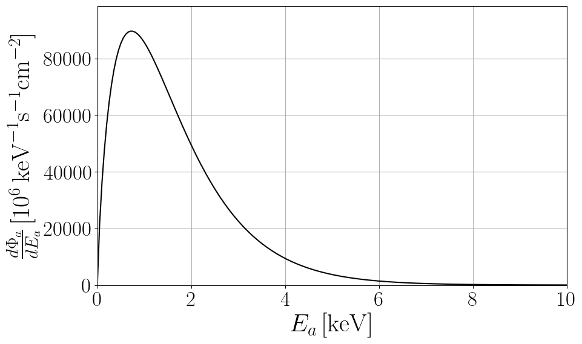

This webpage hosts data files and python notebooks for axion astrophysical fluxes. 

Please, email me [giovanni.grilli@lngs.infn.it] for questions, comments or complaints.

# Solar Axions

<!-- Solar model: AGSS09 [[Serenelli et al. 2009](https://iopscience.iop.org/article/10.1088/0004-637X/705/2/L123), [Serenelli 2010](https://link.springer.com/article/10.1007/s10509-009-0174-8)]-->

An accurate fit of solar axion fluxes at Earth obtained after integrating over the AGSS09 solar model [[Serenelli et al. 2009](https://iopscience.iop.org/article/10.1088/0004-637X/705/2/L123), [Serenelli 2010](https://link.springer.com/article/10.1007/s10509-009-0174-8)] is given by:

$$
\frac{d\Phi_a}{dE_a}= C_0 \left(\frac{g_{ax}}{g_{\mathrm{ref}}}\right)^2 \left(\frac{E}{E_0}\right)^\beta e^{-(1+\beta)\frac{E}{E_0}},
$$

where the axion parameters are shown in the following Table:

|                              | $$g_{\text{ref}}$$              | $$ C_0  (\text{keV}^{-1}~\text{s}^{-1}~\text{cm}^{-2})$$    | $$ E_0 (\text{keV})$$    | $$ \beta $$             |
|------------------------------|----------------------------------|-------------------------------------------------------------|--------------------------|-------------------------|
| Primakoff, $$x = \gamma $$     | $$ 10^{-12}~\text{GeV}^{-1} $$  | $$ (2.19 \pm 0.08)\,10^8 $$                           | $$ 4.17 \pm 0.02 $$      | $$ 2.531 \pm 0.008 $$   |
| Bremsstrahlung, $$ x = e $$    | $$ 10^{-12} $$                  | $$ (3.847 \pm 0.007)\,10^{11} $$                      | $$ 1.63 \pm 0.01 $$      | $$ 0.8063 \pm 0.0003 $$ |
| Compton, $$ x = e $$           | $$ 10^{-12} $$                  | $$ (8.8 \pm 0.1) \, 10^{11} $$                          | $$ 5.10 \pm 0.03 $$      | $$ 2.979 \pm 0.001 $$   |

**Table:** Summary of the fitting parameters to be used in the equation above to reproduce the axion emission from the Sun via Primakoff (coupling to photons $$g_{a\gamma}$$), Bremsstrahlung, and Compton (coupling to electrons $$g_{ae}$$). The uncertainty on the fitting parameters includes the most recent solar models [[Magg et al 2022](https://www.aanda.org/articles/aa/full_html/2022/05/aa42971-21/aa42971-21.html)].

### [View Notebook (.ipynb)](https://github.com/ggrillidc/AxionAstrophysicalFluxes/blob/main/notebooks/SolarAxions.ipynb)

---

## Primakoff

$$g_{a\gamma}=10^{-12}\,\text{GeV}^{-1}$$

Plot ([pdf](https://github.com/ggrillidc/AxionAstrophysicalFluxes/raw/main/plots/Primakoff_SolarAxion_flux_plot.pdf), [png](https://github.com/ggrillidc/AxionAstrophysicalFluxes/raw/main/plots/plots_png/Primakoff_SolarAxion_flux_plot.png))
### &nbsp;
### &nbsp;
### &nbsp;
### &nbsp;

---

## Bremsstrahlung

$$g_{ae}=10^{-12}$$

Plot ([pdf](https://github.com/ggrillidc/AxionAstrophysicalFluxes/raw/main/plots/Bremsstrahlung_SolarAxion_flux_plot.pdf), [png](https://github.com/ggrillidc/AxionAstrophysicalFluxes/raw/main/plots/plots_png/Bremsstrahlung_SolarAxion_flux_plot.png))

### &nbsp;
### &nbsp;
### &nbsp;
### &nbsp;

---

## Compton

$$g_{ae}=10^{-12}$$

Plot ([pdf](https://github.com/ggrillidc/AxionAstrophysicalFluxes/raw/main/plots/Compton_SolarAxion_flux_plot.pdf), [png](https://github.com/ggrillidc/AxionAstrophysicalFluxes/raw/main/plots/plots_png/Compton_SolarAxion_flux_plot.png))

### &nbsp;
### &nbsp;
### &nbsp;
### &nbsp;

---

# Main Sequence stars axions

The quasi-thermal Main Sequence stars axion spectrum at the source can be parametrized by 

$$
\frac{d\Phi_a}{dE_a}= C_0 \left(\frac{g_{ax}}{g_{\mathrm{ref}}}\right)^2 \left(\frac{E}{E_0}\right)^\beta e^{-(1+\beta)\frac{E}{E_0}}
$$

where the axion parameters are now a function of the stellar mass and are given in the following Table:

|  | $$g_{a x}$$ | $$C_{0} (10^{40}\,\text{keV}^{-1}\,\text{s}^{-1}\,\text{cm}^{-2})$$ | $$E_{0} (\text{keV})$$ | $$\beta$$ |
|---|---|---|---|---|
| Primakoff $$x=\gamma$$ | $$10^{-12}\,\text{GeV}^{-1}$$ | $$\begin{cases} -0.140+0.053\,M^{-0.347}e^{M^{0.379}} & \text{for } M<10\,M_{\odot} \\ -0.014+0.011\,M^{1.081} & \text{for } M\geq 10 \, M_{\odot} \end{cases}$$ | $$3.70+1.13\,M^{0.355}$$ | $$1.23+3.63\,e^{-M^{0.29}}$$ |
| Bremsstrahlung $$x=e$$ | $$10^{-12}$$ | $$55.21+1.62\times10^{4}M^{-0.65}$$ | $$0.06+1.80\,M^{0.23}$$ | $$\begin{cases} 0.57 + 0.18 e^{-M^{1.09}} & \text{for } M\le 10 \, M_{\odot} \\ 0.48+0.05 \,M^{0.19} & \text{for } M\geq 10 \, M_{\odot} \end{cases}$$ |
| Compton $$x=e$$ | $$10^{-12}$$ | $$0.14+1.01\,M^{1.49}$$ | $$0.025+6.014\,M^{0.225}$$ | $$2.99-0.56\,e^{-M^{0.09}}$$ |

**Table:** Fitting parameters for Eq.~\eqref{eq:fitprim}, where $M$ is in units of solar masses ${\rm M}_{\odot}$ and these fits are valid in the range $1-100~{\rm M}_{\odot}$.

### [View Notebook (.ipynb)](https://github.com/ggrillidc/AxionAstrophysicalFluxes/blob/main/notebooks/MainSequenceAxions.ipynb)

---

## Primakoff

$$g_{a\gamma}=10^{-12}\,\text{GeV}^{-1}$$

Plot ([pdf](https://github.com/ggrillidc/AxionAstrophysicalFluxes/raw/main/plots/Primakoff_MSAxion_flux_plot.pdf), [png](https://github.com/ggrillidc/AxionAstrophysicalFluxes/raw/main/plots/plots_png/Primakoff_MSAxion_flux_plot.png))
### &nbsp;
### &nbsp;
### &nbsp;
### &nbsp;

---

## Bremsstrahlung

$$g_{ae}=10^{-12}$$

Plot ([pdf](https://github.com/ggrillidc/AxionAstrophysicalFluxes/raw/main/plots/Bremsstrahlung_MSAxion_flux_plot.pdf), [png](https://github.com/ggrillidc/AxionAstrophysicalFluxes/raw/main/plots/plots_png/Bremsstrahlung_MSAxion_flux_plot.png))

### &nbsp;
### &nbsp;
### &nbsp;
### &nbsp;

---

## Compton

$$g_{ae}=10^{-12}$$

Plot ([pdf](https://github.com/ggrillidc/AxionAstrophysicalFluxes/raw/main/plots/Compton_MSAxion_flux_plot.pdf), [png](https://github.com/ggrillidc/AxionAstrophysicalFluxes/raw/main/plots/plots_png/Compton_MSAxion_flux_plot.png))

### &nbsp;
### &nbsp;
### &nbsp;
### &nbsp;

---

# Red Giants axions

---

# Horizontal Branch stars axions

---

# Asymptotic Red Giants axions

---

# White Dwarfs axions

---

# Red Supergiants axions

---

# Core-collapse Supernovae axions

---

# Neutron stars axions

---

# Binary neutron star mergers axions